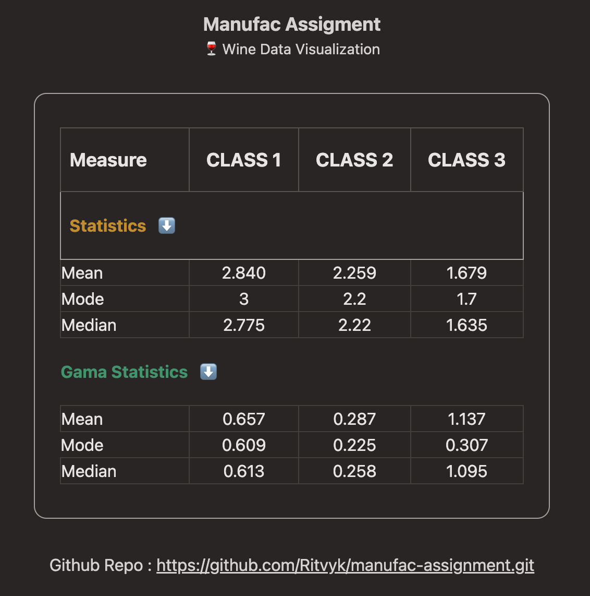

# Wine Data Visualisation

This project was bootstrapped with [Create React App](https://github.com/facebook/create-react-app).

Submission Time : ~ 26th August 2023, 08:24 PM ~

## Available Scripts

In the project directory, you can run:

### `npm start`

Runs the app in the development mode.\
Open [http://localhost:3000](http://localhost:3000) to view it in the browser.

### `npm run build`

Builds the app for production to the `build` folder.\
It correctly bundles React in production mode and optimizes the build for the best performance.

## Description / Brief

## Technical Documentation

`Typescript` + `JSX` \
`TailwindCSS` (For mild styling) \
`Redux` (Better state management)

## ✨ Coding Style

minimal use of `useState` and `useEffect` , taking more power from `redux` and algorithms to simplify calculations.
